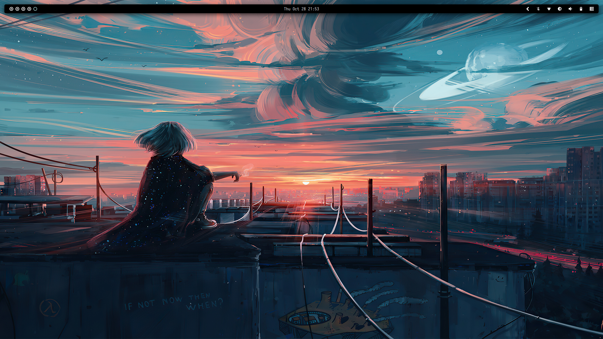

## Screenshot

## Apps
- wm `awesome`
- launcher `rofi`
- terminal `kitty`
- editor `neovim`
- fm `caja`
  
## Wallpaper [aenami.png](https://github.com/nulloneguy/dotfiles/blob/main/.config/awesome/wallpapers/aenami.jpg)
