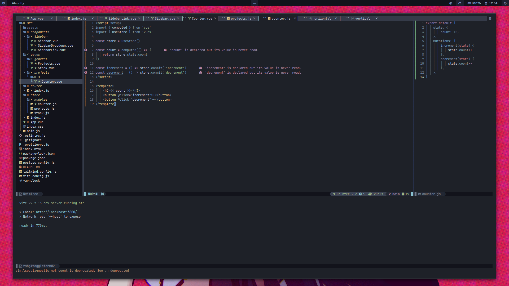

# Openbox

## [New dotfiles](https://github.com/nulloneguy/dotfiles).

## Screenshot 

## Apps
- wm `openbox`
- launcher `rofi`
- themme `Skeuos-white-dark`
- icon `WhiteSur-dark`
- cursor `McMojave`
- terminal `alacritty`
- editor `neovim`
- fm `ranger`

## Install openbox config
- Install ```openbox```

- If you already have a ~/.config/openbox folder, make a backup with: <br/>
`mv ~/.config/openbox ~/.config/OPENBOX.BAK`

- Then copy config: <br/>
`cp -rfv  dotfiles/skel/.config/openbox ~/.config/`

## Install neovim config
- Install `neovim` v0.6 or later

- If you already have a ~/.config/nvim folder, make a backup with: <br/>
`mv ~/.config/nvim ~/.config/NVIM.BAK`

- Then copy config & install plugins with: <br/>
`cp -rfv  dotfiles/skel/.config/nvim ~/.config/` <br/>
`nvim +'hi NormalFloat guibg=#1e222a' +PackerSync`

## Wallpaper 
